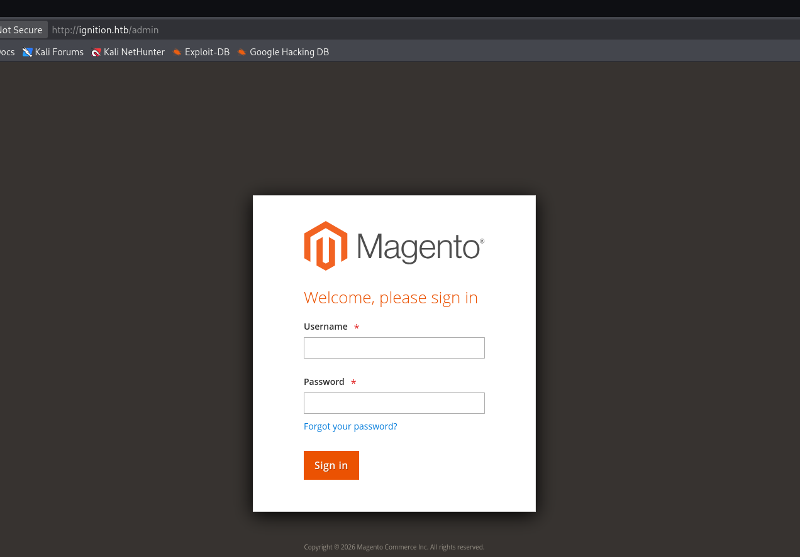
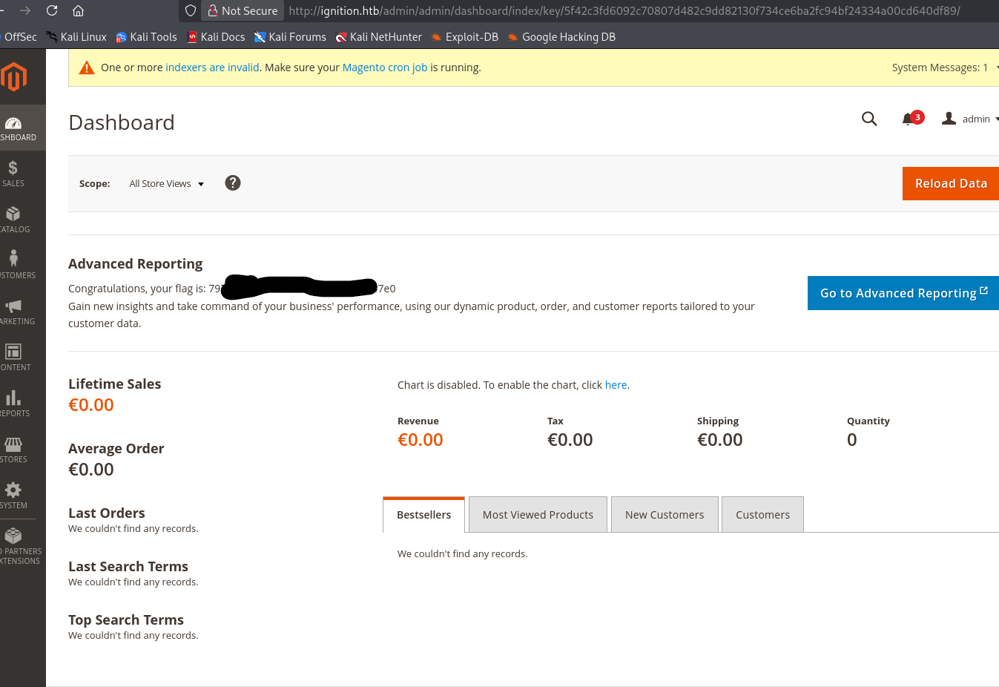

# Introduction

Bienvenue sur **Ignition**, une machine du **Tier 1** de **Starting Point** qui nous rappelle qu'un panneau d'administration exposé avec des identifiants faibles peut suffire à compromettre un système entier. Pas d'exploitation complexe ici, juste de la reconnaissance méthodique, un peu de **Gobuster**, et la bonne vieille recherche de **mots de passe communs**.

Cette machine est parfaite pour comprendre pourquoi la sécurisation des interfaces d'administration est critique, même sur des CMS aussi répandus que **Magento**.

>[!TIP]
>Attention : Il s'agit d'une machine VIP. Vous aurez besoin d'un abonnement HTB pour pouvoir la lancer.

>[!WARNING]
>Dans ce writeup, je ne publie pas directement le flag final, l'objectif est d'apprendre en pratiquant. Si vous voulez le flag, suivez les étapes sur la machine.

>[!CAUTION]
>**NOTE :** n'attaquez que des machines sur lesquelles vous avez l'autorisation (ex. machines HTB, ou lab perso). Respectez les règles de la plateforme.

## Vidéo Walkthrough

Je sortirais bientot un tuto vidéo, d'ici la tu peux aller checker ma chaine Youtube

 RavenBreach


---

## Reconnaissance

### Découverte d'hôte

On commence par un `ping` pour confirmer que la cible est en ligne.

```bash
┌──(kali㉿kali)-[~]
└─$ ping 10.129.1.27

PING 10.129.1.27 (10.129.1.27) 56(84) bytes of data.
64 bytes from 10.129.1.27: icmp_seq=1 ttl=63 time=11.5 ms
64 bytes from 10.129.1.27: icmp_seq=2 ttl=63 time=12.5 ms
64 bytes from 10.129.1.27: icmp_seq=3 ttl=63 time=12.0 ms
^C
--- 10.129.1.27 ping statistics ---
3 packets transmitted, 3 received, 0% packet loss, time 2004ms
rtt min/avg/max/mdev = 11.486/11.989/12.489/0.409 ms
```

La machine Linux répond correctement.

### Énumération des services

Lançons un `nmap` avec détection de versions.

```bash
┌──(kali㉿kali)-[~]
└─$ nmap -sV 10.129.1.27

Starting Nmap 7.98 ( https://nmap.org ) at 2026-01-17 10:33 -0500
Nmap scan report for 10.129.1.27
Host is up (0.013s latency).
Not shown: 999 closed tcp ports (reset)
PORT   STATE SERVICE VERSION
80/tcp open  http    nginx 1.14.2

Service detection performed. Please report any incorrect results at https://nmap.org/submit/ .
Nmap done: 1 IP address (1 host up) scanned in 8.39 seconds
```

Un seul port ouvert : le **port 80** avec un serveur **nginx 1.14.2**. Approfondissons avec les scripts par défaut.

```bash
┌──(kali㉿kali)-[~]
└─$ nmap -p80 -sV -sC 10.129.1.27

Starting Nmap 7.98 ( https://nmap.org ) at 2026-01-17 10:35 -0500
Nmap scan report for 10.129.1.27
Host is up (0.012s latency).

PORT   STATE SERVICE VERSION
80/tcp open  http    nginx 1.14.2
|_http-server-header: nginx/1.14.2
|_http-title: Did not follow redirect to http://ignition.htb/

Service detection performed. Please report any incorrect results at https://nmap.org/submit/ .
Nmap done: 1 IP address (1 host up) scanned in 7.78 seconds
```

Le scan révèle une **redirection 302** vers `http://ignition.htb/`. Le serveur utilise du **Name-Based Virtual Hosting** qui détermine quel site afficher en fonction du nom de domaine dans l'en-tête HTTP `Host`. Sans cette correspondance dans notre fichier `/etc/hosts`, le navigateur ne peut pas résoudre l'adresse.

### Configuration DNS locale

```bash
┌──(kali㉿kali)-[~]
└─$ sudo nano /etc/hosts
```

On ajoute la ligne suivante :

```
10.129.1.27 ignition.htb
```


En accédant maintenant à `http://ignition.htb`, on arrive sur une application web.


L'analyse avec **Wappalyzer** nous révèle qu'il s'agit d'un site **Magento** — un CMS e-commerce très populaire — tournant sur **PHP**, **JavaScript** et **MySQL**.


---

## Pré-Exploitation

### Enumération des répertoires avec Gobuster

La page d'accueil ne présente rien d'exploitable en surface. On tente quelques injections XSS et SQL sur les champs visibles, mais les entrées sont correctement validées et filtrées. On passe donc à l'énumération des répertoires avec **Gobuster**.

```bash
┌──(kali㉿kali)-[~]
└─$ sudo gobuster dir -w /usr/share/wordlists/common.txt -u http://ignition.htb

===============================================================
Gobuster v3.8.2
by OJ Reeves (@TheColonial) & Christian Mehlmauer (@firefart)
===============================================================
[+] Url:                     http://ignition.htb
[+] Method:                  GET
[+] Threads:                 10
[+] Wordlist:                /usr/share/wordlists/common.txt
[+] Negative Status codes:   404
[+] User Agent:              gobuster/3.8.2
[+] Timeout:                 10s
===============================================================
Starting gobuster in directory enumeration mode
===============================================================
0                    (Status: 200) [Size: 25803]
Home                 (Status: 301) [Size: 0] [--> http://ignition.htb/home]
admin                (Status: 200) [Size: 7092]
catalog              (Status: 302) [Size: 0] [--> http://ignition.htb/]
cms                  (Status: 200) [Size: 25817]
contact              (Status: 200) [Size: 28673]
errors               (Status: 301) [Size: 185] [--> http://ignition.htb/errors/]
home                 (Status: 200) [Size: 25802]
media                (Status: 301) [Size: 185] [--> http://ignition.htb/media/]
setup                (Status: 301) [Size: 185] [--> http://ignition.htb/setup/]
soap                 (Status: 200) [Size: 391]
static               (Status: 301) [Size: 185] [--> http://ignition.htb/static/]
Progress: 1942 / 1942 (100.00%)
===============================================================                                                             
Finished
===============================================================
```

La route `/admin` est accessible et retourne un **code 200**. C'est notre cible prioritaire.

### Découverte du panneau d'administration

En naviguant vers `http://ignition.htb/admin`, on découvre le formulaire de connexion du panneau d'administration Magento.



---

## Exploitation

### Recherche d'identifiants valides

Il n'existe pas d'identifiants par défaut universels pour Magento. En revanche, la [documentation officielle d'Adobe pour Magento](https://experienceleague.adobe.com/en/docs/commerce-admin/systems/security/security-admin) précise que la politique de mots de passe impose un minimum de **7 caractères** avec un mélange de **lettres et chiffres**.

La machine date de **2021**. En croisant cette contrainte avec les listes de mots de passe les plus courants de cette année-là, on peut tenter les candidats les plus probables avec le login `admin`.

[Geoff Tuazon Most common passwords; latest 2021 statistics | GCCsDan](https://gccertification.com/most-common-passwords-latest-2021-statistics/)

>[!TIP]
>Sur une vraie mission, on utiliserait Hydra pour automatiser le bruteforce. Ici, la liste est suffisamment courte pour être testée manuellement et éviter tout blocage côté serveur.

En testant `admin` / `qwerty123`, un mot de passe qui respecte les contraintes de longueur et de complexité et qui figurait dans le top des mots de passe les plus utilisés en 2021 et hop la connexion réussit.



On accède au dashboard Magento. Le flag est affiché directement sur l'écran d'administration.

La machine est ***pwned*** !

---

## Conclusion

Cette machine illustre un scénario très courant en pentest interne, un CMS mal sécurisé avec un panel admin exposé et un mot de passe faible. La chaîne d'attaque est simple mais efficace :

1. **Reconnaissance** => Identification d'un serveur **nginx** avec redirection vers `ignition.htb`, ajout dans `/etc/hosts`
2. **Fingerprinting** => Détection d'une application **Magento** via Wappalyzer
3. **Enumération** => Découverte de la route `/admin` avec **Gobuster**
4. **Exploitation** => Connexion au panneau admin avec les identifiants `admin` / `qwerty123`, un mot de passe commun respectant la politique de sécurité de Magento

<!-- ---

## Pour aller plus loin

### Script automatisé
Ce n'est pas encore fait mais je prévois de faire un script automatisé !

### Rapport professionnel
Ce n'est pas encore fait mais je prévois de faire un rapport professionnel ! -->